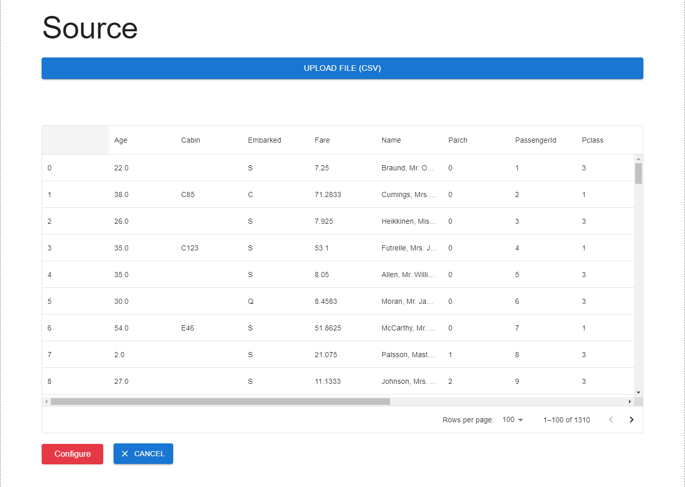
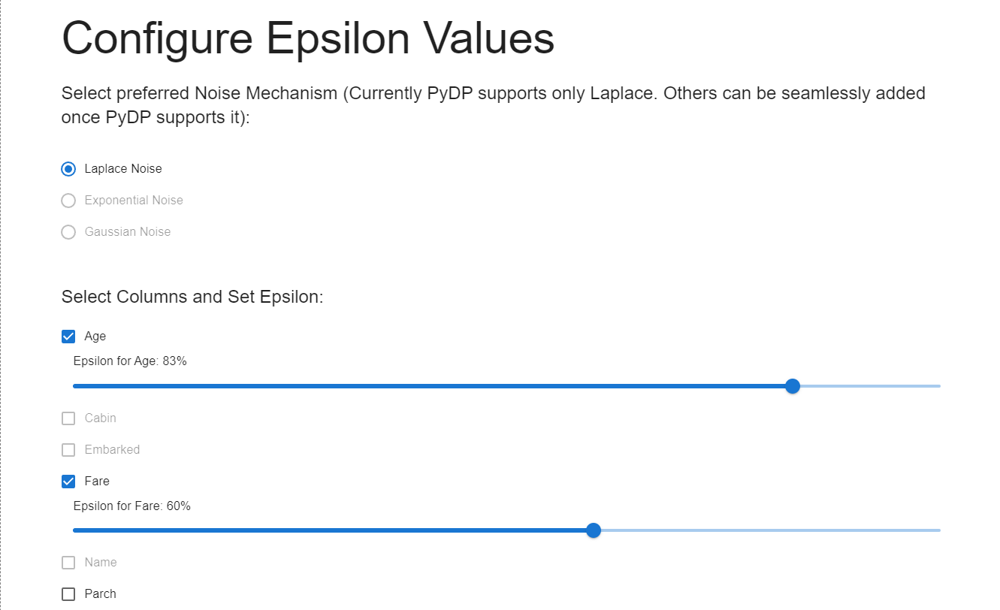
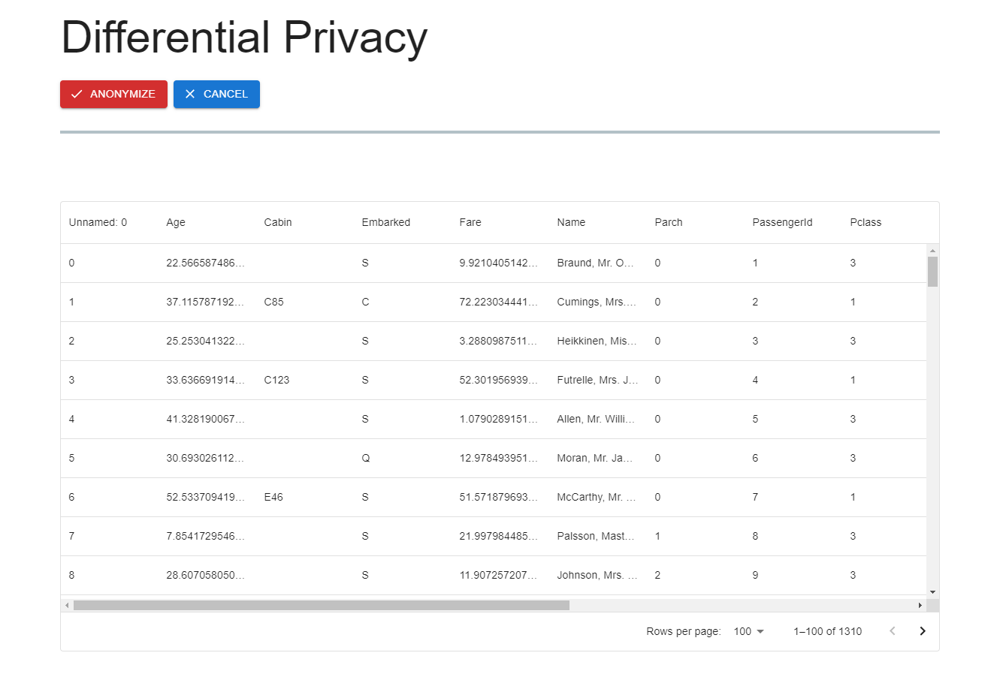

# Ashe-Data-Anonymization
Ashe is an easy-to-use data anoymization application designed to allow publications of datasets for statistical analysis while still protecting the privacy of user data.

# User Scenario
* `SOURCE` - The user will upload a file (csv format)  

 

 
 
 

* `CONFIG` - The user will decide which attributes must be anonymized, and set an epsilon value for each column - which decides the whether to prioritize privacy (low epsilon) or accuracy (high epsilon).

 

 
 
 

3. `ANONYMIZER` - The final step! After configuration, the user starts the anonymization process which returns the anonymized dataset

 

 
 
 

# How to use
You have two different ways to setup Ashe
1. `Docker`
2. `Local`

## Docker
1. Make sure that you're currently in the home directory, which contains `docker-compose.yml`.
2. Run `docker-compose build` to create the image from the docker compose file.
3. Run `docker-compose up` to start the application.
4. Go to `localhost:5173` in your browser.
5. Congratulations on running the Dockerized application.

## Local

### Backend
1. cd into `/backend`.
2. Run `python -m venv flaskvenv`.
3. Run `flaskvenv/Scripts/activate`. This will activate the Flask virtual environment and you should be able to see `(flaskvenv)` in your command line. 
4. In the Flask virtual environment, run `pip install Flask`.
5. To test the Flask virtual environment, cd into `/backend` and run `python3 app.py`.

### Frontend
1. cd into `/Ashe`.
2. Run `npm install` to install dependencies.
3. Run `npm run dev` to start the development server.
4. Follow the link to `localhost:5173`.